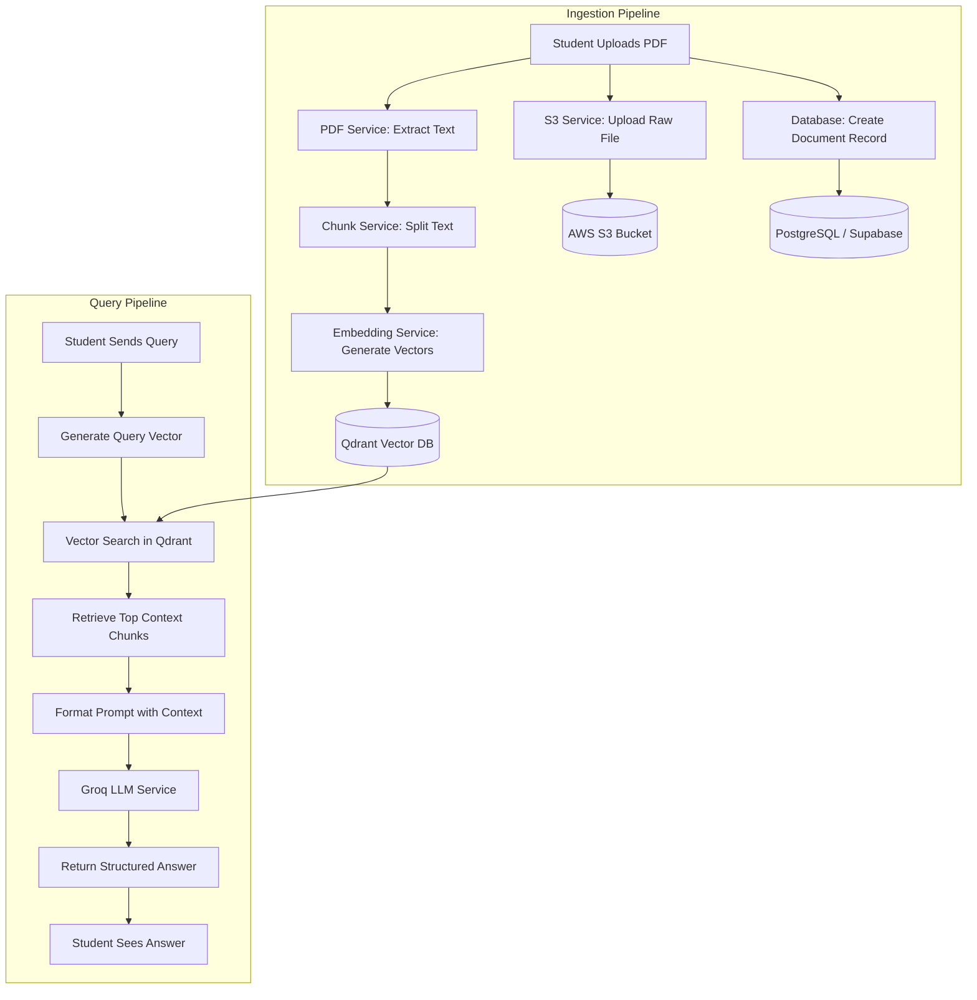

# AI Student Notes Chatbot

An intelligent, AI-powered document assistant designed to help students interact with their study materials. By uploading notes (specifically PDFs), students can ask questions and receive instant, context-aware answers generated using a Retrieval-Augmented Generation (RAG) pipeline.

---

## 🚀 Key Features
1. **User Authentication:** Secure registration and login using JWT tokens and Supabase integration.
2. **Document Ingestion & Processing:** Uploading PDF notes, extracting text, splitting text into logical chunks, and storing the original files in AWS S3 storage.
3. **Vector Embeddings:** Creating semantic vector representations of text chunks using `FastEmbed`.
4. **Vector Database Search:** Storing and querying vector embeddings in a high-performance `Qdrant` vector database to retrieve the most relevant notes context.
5. **RAG-Powered Chat:** A chat interface where questions are matched against document chunks and answered using Groq-powered Large Language Models (LLMs).
6. **Chat Session Management:** Tracking user chat history, maintaining session states, and reloading past conversations.

---

## 🛠️ Technology Stack
*   **Frontend:** React, Vite, TypeScript, TailwindCSS (configured for styling).
*   **Backend:** FastAPI (Python), SQLAlchemy, Alembic (database migrations), Uvicorn.
*   **Vector Database:** Qdrant (semantic vector storage).
*   **Database & Auth:** Supabase (PostgreSQL engine + Auth integration).
*   **File Storage:** AWS S3 (for raw PDF document storage).
*   **LLM API:** Groq (for fast inference/answering).
*   **Embedding Model:** FastEmbed (local, high-speed CPU embedding generation).

---

## 📂 File-by-File Feature Directory

### Backend (`/backend`)
*   [app/main.py](file:///a:/Aakii%20repose/Student_Notes_Chatbot/backend/app/main.py): Entrypoint of the FastAPI application. Sets up CORS, initializes database schemas, and registers routers (`auth`, `document`, `chat`).
*   [app/config.py](file:///a:/Aakii%20repose/Student_Notes_Chatbot/backend/app/config.py): Configuration helper that loads environment variables (DB URLs, AWS S3 keys, Groq API keys, Qdrant URL) using Pydantic Settings.
*   [app/database.py](file:///a:/Aakii%20repose/Student_Notes_Chatbot/backend/app/database.py): Initializes the SQLAlchemy database engine, session factory, and base model class for PostgreSQL/Supabase database connections.
*   [app/dependencies.py](file:///a:/Aakii%20repose/Student_Notes_Chatbot/backend/app/dependencies.py): Houses FastAPI dependency injection functions (e.g., getting the DB session, fetching the current authenticated user from JWT).
*   [app/reset_db.py](file:///a:/Aakii%20repose/Student_Notes_Chatbot/backend/app/reset_db.py): Utility script to drop and recreate database tables for clean testing.
*   [app/routers/auth.py](file:///a:/Aakii%20repose/Student_Notes_Chatbot/backend/app/routers/auth.py): API endpoints for user registration (`/register`) and login (`/login`) to issue JWT security tokens.
*   [app/routers/document.py](file:///a:/Aakii%20repose/Student_Notes_Chatbot/backend/app/routers/document.py): REST API endpoints for document upload (`/upload`), listing documents (`/`), and deleting documents.
*   [app/routers/chat.py](file:///a:/Aakii%20repose/Student_Notes_Chatbot/backend/app/routers/chat.py): API endpoints for creating chat sessions (`/session`), sending queries (`/query`), and retrieving chat history.
*   [app/services/pdf_service.py](file:///a:/Aakii%20repose/Student_Notes_Chatbot/backend/app/services/pdf_service.py): Extracts raw text from uploaded PDF documents using PyMuPDF.
*   [app/services/chunk_service.py](file:///a:/Aakii%20repose/Student_Notes_Chatbot/backend/app/services/chunk_service.py): Splitting extracted document text into smaller, overlapping chunks suitable for embedding models.
*   [app/services/embedding_service.py](file:///a:/Aakii%20repose/Student_Notes_Chatbot/backend/app/services/embedding_service.py): Generates vector embeddings for text chunks using FastEmbed locally.
*   [app/services/qdrant_service.py](file:///a:/Aakii%20repose/Student_Notes_Chatbot/backend/app/services/qdrant_service.py): Manages Qdrant collection creation, inserting embedded vectors, and conducting semantic vector similarity searches.
*   [app/services/s3_service.py](file:///a:/Aakii%20repose/Student_Notes_Chatbot/backend/app/services/s3_service.py): Manages uploading raw files to AWS S3 and generating secure URLs for document retrieval.
*   [app/services/supabase_service.py](file:///a:/Aakii%20repose/Student_Notes_Chatbot/backend/app/services/supabase_service.py): Interfaces with Supabase Auth or database tables if direct authentication tasks are performed.
*   [app/services/document_service.py](file:///a:/Aakii%20repose/Student_Notes_Chatbot/backend/app/services/document_service.py): Coordinates the file upload workflow: saves database records, uploads raw PDFs to S3, extracts text, chunks it, embeds it, and writes chunks to Qdrant.
*   [app/services/groq_service.py](file:///a:/Aakii%20repose/Student_Notes_Chatbot/backend/app/services/groq_service.py): Interfaces with the Groq API to query LLMs (like Llama models) with context and history.
*   [app/services/chat_service.py](file:///a:/Aakii%20repose/Student_Notes_Chatbot/backend/app/services/chat_service.py): Coordinates the chat session workflow, managing database session creation and updating message threads.
*   [app/services/rag_service.py](file:///a:/Aakii%20repose/Student_Notes_Chatbot/backend/app/services/rag_service.py): Orchestrates the Retrieval-Augmented Generation flow by using the similarity search results to build the LLM prompts.

### Frontend (`/frontend`)
*   [src/App.tsx](file:///a:/Aakii%20repose/Student_Notes_Chatbot/frontend/src/App.tsx): The core React application layout containing routing and auth state management.
*   `src/components/`: Houses UI elements such as the PDF Uploader, Chat Area, Sidebar (for history), and Login/Register panels.
*   `src/services/`: Client-side API wrappers for communicating with the FastAPI backend endpoints.

---

## 🔄 End-to-End Workflow (For Reports)

The architecture operates on two primary pipelines: the **Ingestion Pipeline** and the **Query Pipeline**.



### 1. Document Ingestion Pipeline (Step-by-Step)
1. **Upload:** A logged-in student uploads a study PDF through the React frontend dashboard.
2. **Database Record:** The API writes metadata (e.g., file name, owner, AWS S3 URL) into the PostgreSQL database.
3. **Raw Storage:** The original PDF file is sent and stored securely in an AWS S3 bucket.
4. **Text Extraction:** PyMuPDF parses the PDF, reading its textual content page-by-page.
5. **Text Chunking:** The extracted text is split into semantic paragraphs/chunks (e.g., 500-1000 characters) with overlapping windows to preserve context across boundaries.
6. **Vector Generation:** Each text chunk is passed through `FastEmbed` to generate a 384-dimensional dense vector representing its semantic meaning.
7. **Vector Storage:** The vectors, along with the text snippet metadata, are index-stored inside the `Qdrant` vector database.

### 2. Retrieval-Augmented Generation (RAG) Pipeline (Step-by-Step)
1. **Query Input:** The student selects a document (or searches across all documents) and types a question in the chat interface.
2. **Query Embedding:** The question is converted into a vector embedding using the same `FastEmbed` model.
3. **Similarity Search:** The system executes a cosine-similarity query in `Qdrant`, fetching the top $K$ (e.g., 3-5) most relevant text chunks matching the student's question.
4. **Prompt Construction:** The retrieved text chunks are combined with the student's conversation history to create a structured LLM prompt:
   ```text
   You are an assistant. Answer the user's question using ONLY the context provided below.
   Context:
   ---
   [Retrieved Chunk 1]
   [Retrieved Chunk 2]
   ---
   Question: [Student's Question]
   ```
5. **LLM Generation:** The constructed prompt is sent to `Groq` (running high-speed LLMs like Llama-3).
6. **Response & History:** The LLM-generated answer is saved to the database (for chat history tracking) and returned to the React frontend where it is rendered for the student.

---

## 🛠️ Local Development & Setup

### Prerequisites
*   Python 3.11+
*   Node.js & npm
*   Running instances of Qdrant (local or cloud) and Supabase

### Running the Backend
1. Navigate to backend: `cd backend`
2. Create environment variables in `.env` matching your API credentials.
3. Start the server:
   ```bash
   uvicorn app.main:app --reload
   ```

### Running the Frontend
1. Navigate to frontend: `cd frontend`
2. Install Node packages: `npm install`
3. Run the development server:
   ```bash
   npm run dev
   ```
